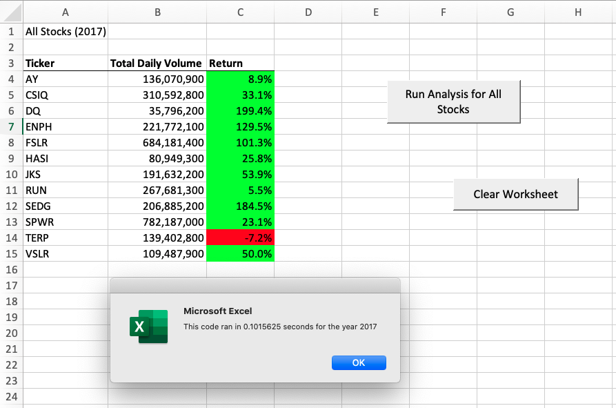
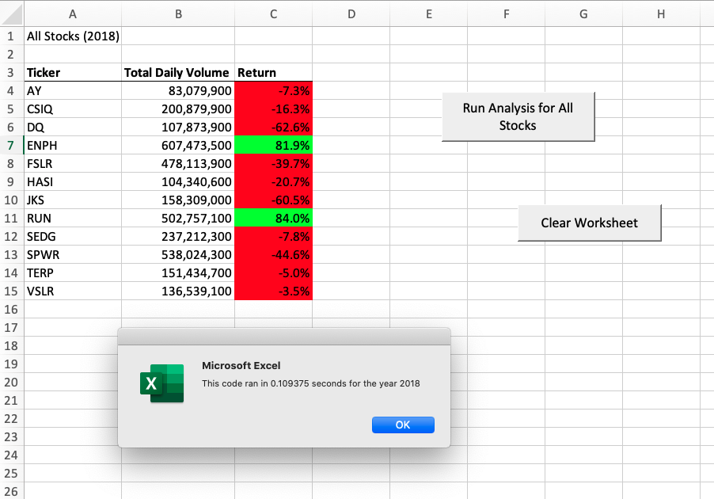

# stock-analysis
Challenge2

## Overview of Project

### Purpose

A stock market investor, Steve, wants an analysis of stock performance for any given stock at any given year. And he wants this see this analysis produced quickly, and he wants the way it is produced simple for him to do.

To meet Steve’s needs, an excel workbook that uses refactored macros and buttons was created.  The workbook , [VBA_Challenge](VBA_Challenge.xlsm), features data from 2018 and 2017 stocks, but more years can be added and the workbook’s analyzing feature will still work. The primary metrics used in the workbook for determining stock performance were Total Daily Volume and Yearly Return. The output for these metrics for each year as well as the buttons that allow a user to quickly and easily run the analysis is on the workbook’s sheet titled “All Stocks Analysis.” The original, unrefactored code to run the analysis can be found here: [Original_Code](Original_Code.docx). The refactored code that runs the same analysis faster can be found here: [VBA_Challenge](VBA_Challenge.vbs)

## Results

### 2017 Stock Performance

Analysis of 2017 stock performance showed the stock “DQ” had the best yearly return at 199.4% and those who owned that stock got a good ROI. Conversely, the stock “TERP” had the worst yearly return of -7.2%. Owners of this stock lost money.

The original code was able to run an analysis of 2017 stock performance in 0.4804688 seconds, whereas the refactored code ran the same analysis in 0.1015625 seconds. That is a 78.8618% decrease in run time. Please see the image below for a visual example of the decreased run time using refactored code.

### 2018 Stock Performance

Analysis of 2018 stock performance showed the stock “RUN” had the best yearly return at 84.0% and those who owned that stock got a good ROI. Conversely, the stock “DQ” had the worst yearly return of -62.6%. Owners of this stock lost money in 2018.

The original code was able to run an analysis of 2018 stock performance in 0.88554688 seconds, whereas the refactored code ran the same analysis in 0.109375 seconds. That is a 87.6489% decrease in run time. Please see the image below for a visual example of the decreased run time using refactored code.

## Summary

- There are advantages to refactoring code. It improves the code’s run time and makes it easier to read.  However, refactoring code is an ongoing project. As code evolves it will need to be refactored repeatedly, and this may be perceived as a disadvantage to refactoring.

- The original code, while shorter and perhaps easier to write, would have taken much longer to perform its job. Especially as the number of years of stock data it has to run through increases. The refactored code, while perhaps requiring more skill and time to write, will handle processing an increased amount data with much greater efficiency. It will also make adding additional features in the future easier to do.

